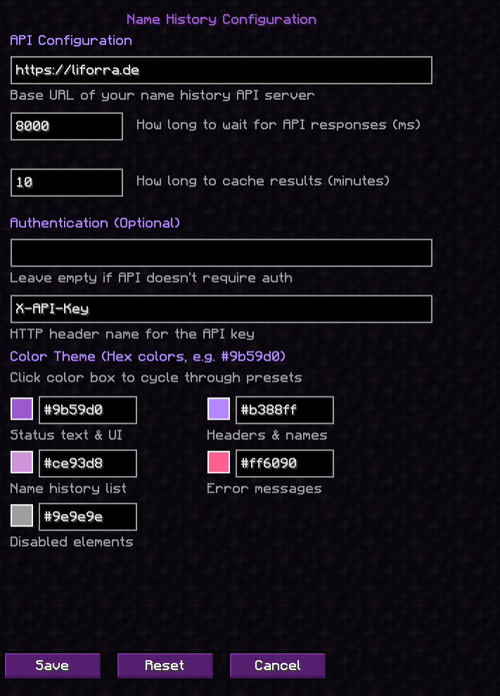

<div align="center">


# 💜 Name History

### *A beautiful, modern Minecraft mod for viewing player username history*

[](https://modrinth.com/mod/fabric-api)
[](https://www.minecraft.net/)
[](https://fabricmc.net/)
[](LICENSE)
[](https://github.com/liforra/namehistory-minecraft)

---

</div>

## ✨ Features

### 🎨 Beautiful UI
- **Modern purple color scheme** that's easy on the eyes
- **Fully customizable colors** - change every aspect of the theme to match your style
- **Real-time color preview** in the config screen with grid layout
- **Click color boxes** to cycle through 40 preset colors

### 🔍 Powerful Lookup
- **Chat Commands** - Quick lookups via `/namehistory <username|uuid>`
- **Player Auto-Complete** - Tab completion for online player names
- **Cached Results** - Fast repeated queries with configurable cache duration
- **Smart Detection** - Automatically detects whether you're searching by username or UUID

### ⚙️ Highly Configurable
- **ModMenu Integration** - Easy configuration through ModMenu
- **API Endpoint** - Connect to any compatible name history API
- **Optional Authentication** - API key support for private servers
- **Customizable Timeouts** - Adjust request timeout and cache duration
- **Grid Layout** - Organized 2-column color configuration

## 🚀 Getting Started

### Installation

1. Install [Fabric Loader](https://fabricmc.net/use/installer/)  
2. Download and install [Fabric API](https://modrinth.com/mod/fabric-api)  
3. Download and install [Fabric Language Kotlin](https://modrinth.com/mod/fabric-language-kotlin)  
4. Download the latest release of Name History  
5. Place the `.jar` file in your `.minecraft/mods` folder  
6. Launch Minecraft!

### Usage

**Commands:**
```bash
/namehistory <username|uuid>  # Look up a player's name history (with tab completion)
/namehistory update <query>   # Force update cached data
/namehistory delete <query>   # Remove cached entry
```

**Examples:**
```bash
/namehistory Notch
/namehistory 069a79f4-44e9-4726-a5be-fca90e38aaf5
/namehistory update jeb_
```

**Tip:** Press Tab after `/namehistory ` to auto-complete from online player names!

## ⚙️ Configuration

The mod creates a config file at `config/namehistory-client.json` on first launch.

### Default Configuration
```json
{
  "baseUrl": "https://liforra.de/api/namehistory",
  "requestTimeoutMs": 8000,
  "cacheTtlMinutes": 10,
  "apiKey": "",
  "apiKeyHeader": "X-API-Key",
  "primaryColor": "#9b59d0",
  "secondaryColor": "#b388ff",
  "specialColor": "#ce93d8",
  "errorColor": "#ff6090",
  "disabledColor": "#9e9e9e"
}
```

### Configuration Options

| Option | Description | Default |
|--------|-------------|---------|
| `baseUrl` | API endpoint URL | `https://liforra.de/api/namehistory` |
| `requestTimeoutMs` | Request timeout in milliseconds | `8000` |
| `cacheTtlMinutes` | Cache duration in minutes | `10` |
| `apiKey` | API key (leave empty if not needed) | `""` |
| `apiKeyHeader` | HTTP header name for API key | `X-API-Key` |
| `primaryColor` | Main UI text color | `#9b59d0` |
| `secondaryColor` | Headers & player names color | `#b388ff` |
| `specialColor` | Name history entries color | `#ce93d8` |
| `errorColor` | Error messages color | `#ff6090` |
| `disabledColor` | Disabled elements color | `#9e9e9e` |

### Using ModMenu
If you have [ModMenu](https://modrinth.com/mod/modmenu) installed:
1. Click "Mods" from the main menu  
2. Find "Name History" in the list  
3. Click the config button  
4. Customize colors by clicking the color preview boxes!

## 🔧 Building from Source

### Prerequisites
- Java 21 or higher  
- Git

### Build Steps
```bash
git clone https://github.com/liforra/namehistory-minecraft.git
cd namehistory-minecraft
./gradlew build
```

The compiled mod will be in `build/libs/name-history-0.1.0.jar`.

## 🌐 API Compatibility

This mod works with any API that implements the following endpoints:

| Method | Endpoint | Description |
|--------|----------|-------------|
| `GET` | `/api/namehistory?username=<username>` | Get history by username |
| `GET` | `/api/namehistory/uuid/<uuid>` | Get history by UUID |
| `POST` | `/api/namehistory/update` | Force update player data |
| `DELETE` | `/api/namehistory?username=<username>` | Delete cached entry |

### 📄 Full API Documentation
- **OpenAPI Specification**: [`openapi.yaml`](openapi.yaml)  
- **Detailed Documentation**: [API.md](API.md)

### Response Format
```json
{
  "uuid": "069a79f4-44e9-4726-a5be-fca90e38aaf5",
  "query": "Notch",
  "history": [
    { "id": 1, "name": "Notch", "changedAt": null, "censored": false }
  ]
}
```

> 💡 Tip: Use the OpenAPI spec to generate client libraries or server stubs.

## 📸 Screenshots

<div align="center">

### Chat Command Output


### Configuration Screen


</div>

## 🎨 Artwork and Attribution

- The purple icon used in this project is a modified derivative of `icon.png`
  from the project “fabric-name-history-lookup” by Woolyenough  
  (Copyright © 2022 Woolyenough), licensed under the MIT License.
- Original repository: https://github.com/Woolyenough/fabric-name-history-lookup  
- Changes: recoloring to purple, removal of the stem, centering of the glyph,
  and minor pixel adjustments for the theme.

This project includes the MIT license text and copyright notice for that
asset in `ICON_NOTICE.txt`.

No endorsement by the original author is implied.

## 📝 License

This project is licensed under the **GNU Affero General Public License v3.0 (AGPL-3.0)**.  
See [LICENSE](LICENSE) for details.

Third‑party components:
- Icon derivative: MIT-licensed work by Woolyenough (see `ICON_NOTICE.txt`).

## 🤝 Contributing

Contributions are welcome! Feel free to:
- Report bugs  
- Suggest new features  
- Submit pull requests  
- Improve documentation

## 💖 Credits

- Built with [Fabric](https://fabricmc.net/)  
- Written in [Kotlin](https://kotlinlang.org/)  
- Inspired by the need for a beautiful, modern name history viewer

---

Made with 💜 by [liforra](https://github.com/liforra)